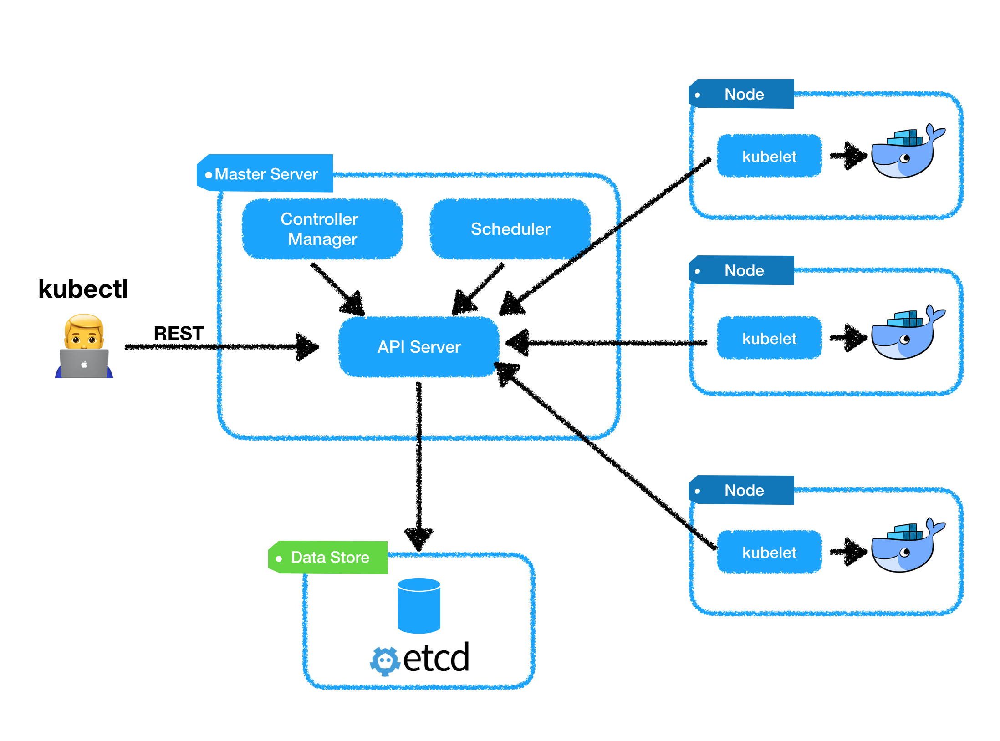

### DOCKER & KUBERNETES

>  쿠버네티스는 구글이 지난 10여년 간 컨테이너를 프로덕션 환경에서 사용하면서 얻은 경험을 바탕으로 개발한 컨테이너-통합도구이다.


필요한 개념들

- PODS(팟즈)

  pod는 컨테이너들의 그룹으로 같이 배포되고 스케줄된다.

  쿠버네티스의 경우 단일 유닛으로 스캐줄되며 단일 컨테이너와는 반대되는 개념이다. 

  일반적으로 1개에서 5개의 컨테이너들을 포함한다.

  사용자 컨테이너들과 함께 로깅과 모니터링을 위한 다른 컨테이너들도 실행하게 된다. 

  팟들은 비교적 짧은 시간에 사라지는데 시스템이 발전할수록 생성과 파괴를 반복한다. 

- Flat Networking Space

  기존 도커 브릿지 네트워크와 비교했을 때 쿠버네티스의 네트워킹은 다름

  도커 브릿지는 컨테이너들이 내부 서브넷(Private Subnet)에 위치하고 다른 호스트들의 컨테이너들과 통신을 하기 위해서는 호스트의 포트를 포워딩하거나 프록시를 사용해야한다.

  쿠버네티스에서는 팟 내의 컨테이너들은 단일 IP주소를 공유하지만 주소 공간은 모든 팟에서 평평하다.(Flat)

  모든 팟들은 별도의 네트워크 변환(NAT) 없이 서로 통신이 가능하다.

  다중 호스트 클러스터(Multihost Clusters)의 관리를 위해 링크의 지원이 없이 간편해지지만 단일 호스트 네트워킹은 조금 복잡해졌다.

  같은 포트 내의 컨테이너들이 한개의 IP 주소를 공유하기 때문에 컨테이너들은 localhost 주소의 포트들을 이용해서 통신하게 된다. (팟 내부에서의 포트 사용을 조율할 필요가 생김)

- LABELS(레이블)

  일반적으로 팟을 의미하는 쿠버네티스 객체에 붙여진 key-value 쌍들이다.

  이를 통해 객체(팟)의 특성(ex)version: dev tier: frontend)을 파악한다.

  레이블이 중복되는 경우가 많고 컨테이너 그룹을 구분한다.

  **Label Selector** 들은 객체나 객체의 그룹(모든 팟들 중 실제 서비스환경에 있는 팟들)을 찾아내는데 사용될 수있다.

  레이블을 이용하여 팟들을 부하 분산 그룹(load balancing group)들에 할당하거나 팟들을 그룹들 사이로 이동하는 작업을 쉽게 만든다.

- Services(서비스)

  이름으로 접근 가능한 안정적인 End Point들을 의미한다.

  Label selector를 이용해서 서비스를 팟에 연결할 수 있다.

  예시)

  - 캐시(cache)라는 서비스는 "type": "redis"를 레이블 선택자로 해서 확인된 여러 "redis" 팟들에 연결될 수 있다.

  서비스들은 팟들 사이에서 자동으로 요청을 round-robin으로 할당한다.

  이렇게 서비스들이 시스템의 각 부분들끼리 연결하기 위해 사용될 수 있다.

  추상화를 위한 단계를 제공해서 응용프로그램들이 서비스의 자세한 내부정보 없이 호출할 수 있게 한다. 

  팟 내에서 작동 중인 응용 프로그램 코드는 호출할 DBMS의 이름과 포트만 알면 되고, DB가 얼마나 많은 팟들로 서비스되는지 마지막으로 통신한 팟이 뭔지 알 필요가 없다.

  쿠버네티스는 클러스터를 위해 새로운 서비스를 지켜보는 DNS 서버를 설치해서 이들이 응용프로그램 코드와 설정파일에서 이름으로 접근할 수 있도록 해준다.


## 완벽한 IT 인프라 구축을 위한 DOCKER

----

### 9.2 Kubernetes 개요

#### Kubernetes란?

> 여러 개의 호스트를 하나로 묶어 Docker를 이용하기 위한 오케스트레이션 툴

분산 환경에서 한 대의 컴퓨터처럼 투과적으로 컨테이너에 엑세스할 수 있다.

시스템 이용자로부터 오는 부하의 급증에 대해 스케일하거나 여러 컨테이너를 효율적으로 통합 관리하는 장치도 있다.

주요 기능들

- 여러 서버들에서의 컨테이너 관리
- 컨테이너 간 네트워크 관리
- 컨테이너의 부하 분산
- 컨테이너의 감시
- 무정지로 업데이트


#### Kubernetes의 서버 구성

----

**Master Server**

- kubernetes 클러스터 안의 컨테이너를 조작하기 위한 server

kubect1[^1] 명령을 사용하여 클러스터를 구성하거나 리소스를 조작할 때
Master Server가 command로부터 request를 받아 처리한다. 
클러스터 내의 노드의 리소스 사용 현황을 확인하고, 컨테이너를 시작할 노드를
자동으로 선택한다. **다중화를 검토**할 필요가 있다.


**Back-end Database(etcd)**

- 분산 key-value store, 클러스터의 구성 정보를 관리한다.

클러스터를 구축하기 위한 설정 정보가 들어 있다.

시스템 구성에 따라서 etcd를 master server상에 구축하는 경우도 있다. 
master server와 마찬가지로 **다중화를 검토**할 필요가 있다.


**Node**

- 실제로 Docker container를 작동시키는 서버

노드를 여러 개 마련하여 cluster를 구성한다. master server의 관리를 받는다.
노드를 몇 대 마련할지는 시스템의 규모나 부하에 따라 달라진다.
클라우드 환경에서는 Node 하나가 가상 머신의 인스턴스 하나가 된다.


[^1]: Kubectl 는 쿠버네티스 클러스터를 조작하기 위한 cli이다. [kubect1 overview](https://kubernetes.io/docs/reference/kubectl/overview/)


#### Application 구성 관리

----

application 실행 환경의 orchestration 을 유연하게 수행하기 위해
다양한 추상화를 하고 있다.


**Pod**

- 여러개의 컨테이너를 모아서 **'pod'**로 관리한다.

app server용 컨테이너와 proxy server용 컨테이너 등 관련된 것들을 pod로 모은다.
Pod는 application의 **Deployment 단위**가 되며 Pod 단위로 컨테이너 작성/시작/정지/삭제
와 같은 조작을 수행한다. 따라서 웹 프론트 서버와 데이터베이스 서버처럼 다른 기능을
하나의 Pod에 저장하면 안된다.

Pod는 반드시 동일한 노드 상에 동시에 전개된다. Pod 안의 여러 컨테이너가 가상 NIC(private IP)[^2]를 공유하는 구성을 취하기 때문에 컨테이너끼리 localhost 경유로 
통신할 수 있다.


**Replica Set**

- 클러스터 상에 미리 지정된 Pod를 작성하여 실행시켜두는 장치

클러스터 상에 정해진 수의 Pod를 반드시 실행시켜 둔다는 것
실행중인 Pod를 감시하고 정지된 경우에 해당 Pod를 삭제하고, 새로운 Pod를 실행시킨다.
클라우드 안에 pod를 얼마나 실행시켜 둘지를 **'Replica 수'**라고 한다. 
pod의 수를 동적으로 변경하여 **오토스케일**을 구현할 수 있다.


**Deployment**

- Pod와 ReplicaSet을 모은 것
  ReplicaSet의 이력을 관리하는 것이다.

ReplicaSet의 템플릿을 가지고 거기서 Pod의 구성을 정의하여 해당 템플릿을 따르는
ReplicaSet을 만든다. 이력을 관리할 수 있기 때문에 pod 안의 컨테이너의 버전업을 
하고 싶을 때 롤링 업데이트[^3]를 하거나 이전 세대로 롤백할 수 있다. 기본적으로 **'Blue-Green Deployment'** 방법이 있다.


이 외에도 

- **DeamonSet** : Node별로 감시 에이전트와 같은 특정 pod를 반드시 배치하고 싶을 때 사용
- **Jobs** : 상주 서비스가 아닌 수치연산 처리와 같이 프로그램의 시작부터 종료까지로 완료되는 프로그램을 Pod에서 실행시킨다.
- **CronJob** : Linux의 cron[^4]과 같이 Pod를 실행시킬 타이밍을 지정한다.

등의 관리 툴들이 있다.

[^2]: (Network Interface Controller) Host에서 network와의 연결을 담당하는 인터페이스 역할을 하는 장치, 여기서는 L2 switch를 의미하는 듯 하다.
[^3]: (무중단배포)Pod 인스턴스를 점진적으로 새로운 것으로 업데이트하여 디플로이먼트 업데이트가 서비스 중단 없이 이루어질 수 있도록 해준다.
[^4]: 운영체제의 시간 기반 Job scheduler. 작업을 고정된 시간, 날짜, 간격에 주기적으로 실행할 수 있도록 스케줄링하기위해 사용(특정시간마다 log 분석 등을 할때 유용할듯)


#### Network 관리(Service)

----

클러스터 안에서 실행되는 Pod에 대해 외부로부터 엑세스할 때는 서비스를 정의한다.
**Service**는 네트워크를 관리하는 것으로 종류가 다양하다. 

- **Load Balancer** : Service에 대응하는 IP 주소 + 포트번호에 엑세스하면 여러 Pod에 대한 L4 level의 로드벨런싱이 일어난다.

Service에 할당되는 IP 주소는

- **Cluster IP** : cluster 내부의 Pod끼리의 통신을 위한 Private IP
  pod에서 보내는 패킷은 Node 상의 Proxy 데몬이 받아 수신 Pod로 전송된다.
- **External IP** : 외부 client와 연결하기 위한 public IP 주소 
  Pod를 새로 실행하면 기존 서비스의 IP 주소와 포트 번호는 환경변수로 참조할 수 있다.

Service 외에..

**Ingress**라는 pod에 대한 통신을 제어하는 기능이 있다. Ingress는 Service와 연결되어 통신 내용을 중계(proxy)한다. 이는 작동하는 환경에 따라 다른데, GCP의 경우
HTTP Load Balancer를 사용한다. L7에서 작동하기 때문에 request url 별 분류나 virtual host 기능 등 보다 세세한 네트워크 제어를 할 수 있다.


#### Label을 사용한 리소스 식별

-----

리소스를 식별하기 위해 내부에서 자동으로 랜덤한 이름이 부여됨
이 이름으로 적절히 관리하기 어렵기 때문에 **Label**을 붙여서 관리한다.

- 리소스를 식별하기 위한 Key-Value 형태의 임의의 문자열

Label을 identifier로 하여 리소스를 일괄적으로 처리한다. 

Label은 하나의 리소스에 여러개를 설정할 수 있어서 Pod의 역할별로 임의의 이름을
붙이거나 관련 있는 Pod 별로 모아서 유연하게 관리하고자 할때 유용하다.

또한 **매니페스트** 라는 kubernetes의 정의 파일을 참조할 때도 사용됩니다.

ex)

```
labels:
  app: v1.0
selector:
  type: webserver
  app: v1.0
```


#### Kubernetes의 구조

 마스터, 데이터 스토어, 노드가 서로 협력하면서 컨테이너의 실행환경을 관리한다.




**Master**

- **API Server**

  kubernetes의 리소스 정보를 관리하기 위한 Front-end REST API

  각 component로부터 리소스 정보를 받아 etcd에 저장한다.

  component들은 etcd에 접근하기위해 API server를 거치고

  프로그래머는 웹의 GUI툴이나 kubectl 명령을 사용하고, app 내에서 API Server를 호출한다. 

  인증, 인가 기능을 갖고 있음

- **Scheduler**

  Pod를 어떤 Node에서 작동시킬지 제어하는 Back-end component

  Node가 할당되지 않은 Pod를 클러스터의 상태를 확인하고 빈 영역을 가진 Node를 찾아

  실행시키는 스캐쥴링을 수행

- **Controller Manager**

  Kubernetes 클러스터의 상태를 항상 감시하는 Back-end Component

  정의 파일에서 정의한 것과 실제 Node나 Container에서 움직이고 있는 상태를 모아서 관리


**Data Store(etcd)**

클러스터 구성을 유지 관리하는 KVS(key value store)

어떤 pod를 어떻게 배치할지와 같은 구성 정보를 갖고 있으며 API server가 참조한다. 


**Node**

- **kubelet**

  Node에서 작동하는 에이전트

  Pod의 정의 파일에 따라 Docker 컨테이너를 실행하거나 Storage를 마운트하는 기능을 갖는다.

  Node의 status를 정기적으로 감시하는 기능을 갖고, status가 변경되면 API server에게 알린다.


kubernetes의 클러스터 구성정보를 YAML이나 JSON으로 관리하는데 이 정의파일을
**Manifest file**이라고 한다. Jenkins와 같은 소프트웨어 버전관리 시스템과 연계할 수 있다.

